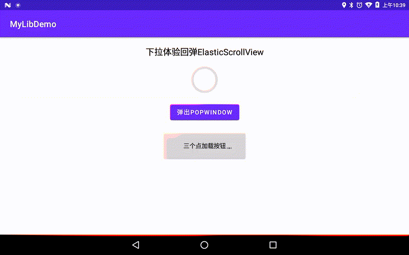

### 收集一些常见控件

1. `ElasticScrollView `垂直方向反弹效果的实现
2. `DotsLoadingButton `淡入淡出点的加载按钮
3. `YjzPopupWindow `原生PopupWindow封装
4. `SmoothCheckBox `带动画效果的CheckBox，支持矩形和圆形
5. [headeradapter——让RecyclerView像ListView一样添加头部和尾部](https://github.com/donkingliang/HeaderViewAdapter)

### Demo展示

